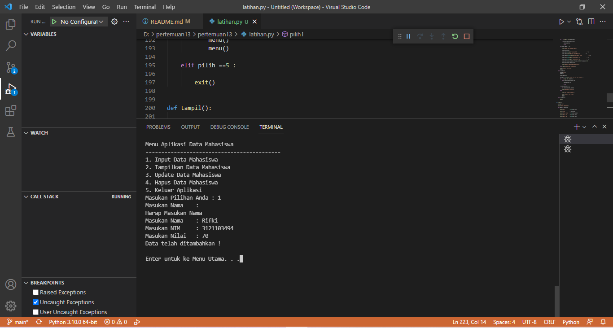

# pertemuan13
## MUHAMAD RIFKI
### TUGAS PERTEMUAN 12
•Implementasikan penggunaan eksepsi pada lab-lab
sebelumnya untuk mengatasi error yang ditimbulkan.

Saya menggunakan eksepsi pada tugas sebelum nya di bagian input data.
Berikut adalah tambahan kode eksepsi.

    while True:
            try:
                nim = int(input("Masukan NIM\t: "))
                if nim == "":
                    print("NIM tidak boleh kosong")
                else:
                    break
            except:
                print("Harap Masukan Angka")
            else:
                break
            
    while True:
            try:
                nilai = int(input("Masukan Nilai\t: "))
                if nilai == "":
                    print("Nilai tidak boleh kosong")
                else:
                    break
            except:
                print("Harap Masukan Angka")
            else:
                break

Dengan menambahakan eksepsi maka:

- Saat input data kosong maka akan meminta untuk memasukan data kembali

- Saat input NIM dan Nilai menggunakan karakter maka program akan meminta untuk memasukan angka.

